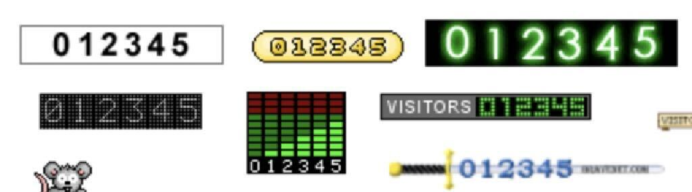

# PostHog Hit Counter

A skeuomorphic, embeddable hit counter powered by PostHog analytics. Display visitor counts on your website with beautiful retro-inspired designs.



## Features

- 🎨 **5 Beautiful Styles**: Retro, Digital, Minimal, Classic, and Neon
- 📊 **Page-Specific Counts**: Shows visitor count for each individual page
- 🌓 **Dark Mode Support**: Automatic dark mode detection
- 📦 **Dual Distribution**: Use as React component or embed script
- ⚡ **Lightweight**: Minimal bundle size
- 🔒 **Secure**: Your API key stays server-side

## 🚀 Quick Start (5 minutes)

Since PostHog requires secure API keys, you'll need to deploy your own instance. Don't worry - it's free and takes just 5 minutes!

### Step 1: Deploy to Vercel (2 min)

[](https://vercel.com/new/clone?repository-url=https%3A%2F%2Fgithub.com%2Fcorywatilo%2Fposthog-hit-counter&env=POSTHOG_PERSONAL_API_KEY,POSTHOG_PROJECT_ID,POSTHOG_HOST&envDescription=PostHog%20API%20credentials%20for%20your%20hit%20counter&envLink=https%3A%2F%2Fgithub.com%2Fcorywatilo%2Fposthog-hit-counter%23step-2-get-posthog-credentials&project-name=my-hit-counter&repository-name=my-hit-counter)

1. Click the **"Deploy with Vercel"** button above
2. Sign in to Vercel (or create a free account)
3. You'll see "Configure Project" - don't add environment variables yet
4. Click **"Deploy"** and wait for the build to complete (~2 minutes)
5. Note your deployment URL (like `my-hit-counter.vercel.app`)

### Step 2: Get PostHog Credentials (2 min)

1. Sign in to [PostHog](https://app.posthog.com)
2. Navigate to **Project Settings** (gear icon in sidebar)
3. Click **"Personal API Keys"** in the left menu
4. Click **"+ Create personal API key"**
5. Give it a name like "Hit Counter"
6. Select these scopes:
   - ✅ **Read access to events**
   - ✅ **Read access to projects** 
7. Click **"Create key"** and copy the key (starts with `phx_`)
8. Find your **Project ID**:
   - Look at your browser URL: `https://app.posthog.com/project/12345/`
   - The number (e.g., `12345`) is your Project ID

### Step 3: Add Environment Variables (1 min)

1. Go to your [Vercel Dashboard](https://vercel.com/dashboard)
2. Click on your new hit counter project
3. Navigate to **"Settings"** → **"Environment Variables"**
4. Add these variables:
   - `POSTHOG_PERSONAL_API_KEY` = Your personal API key from Step 2
   - `POSTHOG_PROJECT_ID` = Your project ID from Step 2
5. Click **"Save"** for each variable
6. Go to **"Deployments"** tab
7. Click the three dots menu on the latest deployment → **"Redeploy"**
8. Click **"Redeploy"** in the dialog (don't change any settings)

### Step 4: Use Your Counter! 🎉

Once redeployed, your counter is ready! Use it anywhere:

#### As an Embed Script
```html
<!-- IMPORTANT: Use YOUR deployment URL, not the demo! -->
<!-- ❌ WRONG: https://posthog-hit-counter.vercel.app (this is the demo) -->
<!-- ✅ RIGHT: https://YOUR-DEPLOYMENT.vercel.app (your deployment with your API key) -->

<script 
  src="https://YOUR-DEPLOYMENT.vercel.app/embed" 
  data-style="retro"
  data-days="30"
  data-label="Page Views"
></script>
```

#### For React/Next.js
```jsx
<Script
  src="https://YOUR-DEPLOYMENT.vercel.app/embed"
  strategy="lazyOnload"
  data-style="digital"
/>
```

#### Test It First
Visit your demo page at: `https://my-hit-counter.vercel.app`

## 📝 Usage Examples

### Basic Counter (Default Style)
```html
<script src="https://my-hit-counter.vercel.app/embed"></script>
```

### Digital Style with 7-Day Count
```html
<script 
  src="https://my-hit-counter.vercel.app/embed" 
  data-style="digital"
  data-days="7"
  data-label="This Week"
></script>
```

### All Styles Demo
Try the demo with random data:
```html
<script src="https://posthog-hit-counter.vercel.app/embed"></script>
```

## Configuration Options

### Embed Script Parameters

| Parameter | Values | Default | Description |
|-----------|--------|---------|-------------|
| `data-style` | `retro`, `digital`, `minimal`, `classic`, `neon` | `retro` | Counter visual style |
| `data-days` | Number or `all` | `all` | Days to count (e.g., `7`, `30`, `all`) |
| `data-label` | Any text | `Visitors` | Label shown below counter |
| `data-dark` | `auto`, `light`, `dark` | `auto` | Dark mode setting |

### Counter Styles

- **Retro** (`retro`): Classic green LCD display with glow effect
- **Digital** (`digital`): Red seven-segment display style  
- **Minimal** (`minimal`): Clean, modern text display
- **Classic** (`classic`): Traditional mechanical counter look
- **Neon** (`neon`): Purple glowing cyberpunk aesthetic

## 🔧 Advanced Usage

### React/Next.js Component

If you're building a React app, you can also install the component directly:

```bash
npm install posthog-hit-counter
```

```jsx
import { PostHogHitCounter } from 'posthog-hit-counter';

function MyPage() {
  return (
    <PostHogHitCounter
      style="digital"
      timeframe={30}
      label="Monthly Visitors"
      darkMode="auto"
    />
  );
}
```

Note: The React component requires the same Vercel deployment for the API endpoint.

### Multiple Counters on One Page

You can add multiple counters with different styles:

```html
<!-- Total visitors -->
<script 
  src="https://my-hit-counter.vercel.app/embed" 
  data-style="retro"
  data-days="all"
  data-label="Total Visitors"
></script>

<!-- This month -->
<script 
  src="https://my-hit-counter.vercel.app/embed" 
  data-style="digital"
  data-days="30"
  data-label="This Month"
></script>

<!-- Today -->
<script 
  src="https://my-hit-counter.vercel.app/embed" 
  data-style="minimal"
  data-days="1"
  data-label="Today"
></script>
```

## 💰 Pricing

This solution is completely free for most websites:

- **Vercel Free Tier**: 100GB bandwidth/month (more than enough for counters)
- **PostHog Free Tier**: 1M events/month
- **Total Cost**: $0

## 🔒 Security

Your PostHog API key is never exposed to browsers:
- Stored securely in Vercel environment variables
- API calls made server-side through `/api/pageviews`
- Each page gets its own accurate count

## 🐛 Troubleshooting

### Counter shows random numbers
- This means environment variables aren't set
- Follow Step 3 to add your PostHog credentials
- Remember to redeploy after adding variables

### Counter shows 0
- Check that your PostHog project is tracking pageviews
- Verify the Project ID is correct
- Ensure your API key has `event:read` scope

### Counter doesn't appear
- Check browser console for errors
- Verify your Vercel deployment URL is correct
- Try visiting the demo page directly

## 📦 Development

```bash
# Clone your fork
git clone https://github.com/your-username/my-hit-counter
cd my-hit-counter

# Install dependencies
npm install

# Set up local environment
cp .env.example .env.local
# Edit .env.local with your PostHog credentials

# Run development server
npm run dev

# Build for production
npm run build
```

## 🤝 Contributing

Contributions are welcome! Feel free to:
- Add new counter styles
- Improve performance
- Fix bugs
- Update documentation

## 📄 License

MIT - Use this however you'd like!