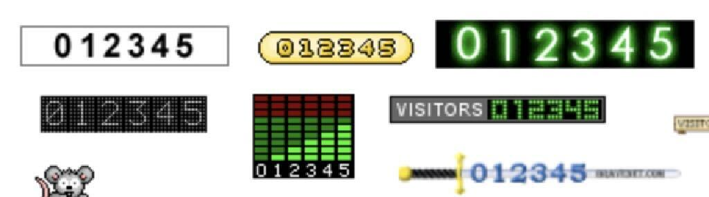

# 🧮 PostHog hit counter

## 🧠 Overview

Create a skeuomorphic, embeddable hit counter powered by PostHog. The goal is to make it feel like an old-school visitor counter (retro/analog/digital themes), but pulling live data via the PostHog API. No saved insights or prior setup required.

This should be zero-config for PostHog users—drop it into your site and it just works.

## 🧰 Tech Stack

• Frontend: Next.js (deployed on Vercel)
• Styling: Tailwind CSS
• Data Source: PostHog API (client-side fetch)
• Delivery: Packaged as a lightweight npm package or JS embed script (via Vercel Edge/CDN)

## ✅ Core Features

• Live Page View Counts
• Fetches view count directly from PostHog for the current page (based on URL path).
• Timeframe is configurable (default: all time).
• Select from themes. Examples:

• Support for reading dark mode via the `prefers-color-scheme` media query.

## ⚙️ Integration Options

### React Component (npm)

```
<PostHogHitCounter
  projectApiKey="phc_..."
  style="counter"
  timeframe="30"
  className="text-green-500"
/>
```

### Embed Script (no React)

```
<script src="https://yourcdn.com/hit-counter.js" data-key="phc_..." data-style="counter" data-days="all"></script>
```

• Both options auto-detect the current page path and call the API with the appropriate filters.

## 📡 PostHog API Integration

• Uses the `/api/projects/{id}/events/` endpoint with filters like:
• `$current_url` or `$pathname`
• `$pageview`
• `after` + `before` timestamps
• Can fall back to fetch from client if project API key is public and scoped

## 🛠 Dev Tasks

1. Scaffold Next.js project & Tailwind config
2. Build component shell with props + styling variants
3. Integrate PostHog fetcher (based on window.location.pathname)
4. Add fallback states (loading, error, 0 views)
5. Package as both npm component and embeddable script
6. Deploy to Vercel + add simple demo page
7. Document setup (with live examples)
